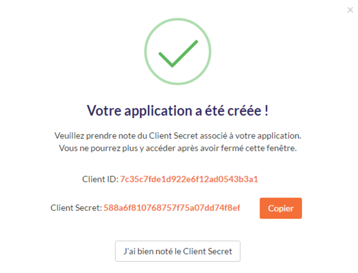

# api-tutorials

## Authentication
 
This first tutorial will show you how to authenticate to our APIs.
 
To authenticate you need your client_id and client_secret that you can find on our website : https://app.digitaleo.com/.  It will be given to you if you try to create a new application.
To create a new application you need to click on “My account” then “Parameters”. In the parameters’ board you can find a tab named “My applications”. Select this tab and click on the button “Add an application”. Follow the few steps to create the application and at the end you will receive your Client ID and Client Secret.

